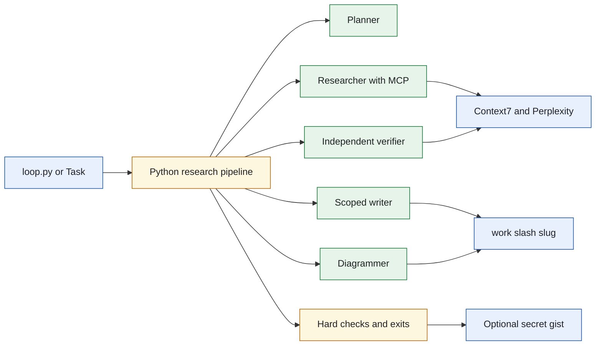
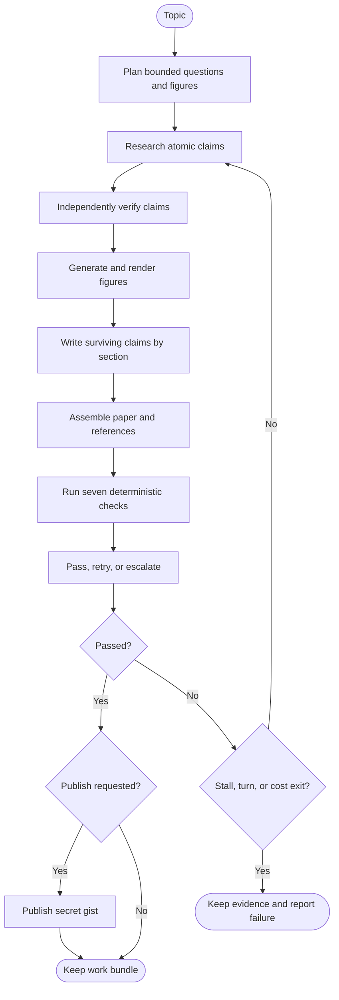
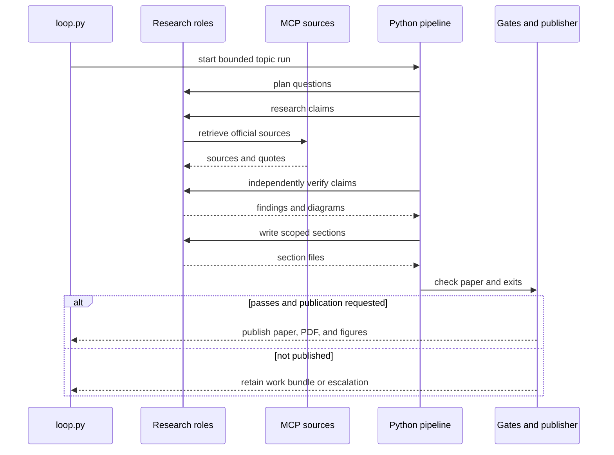
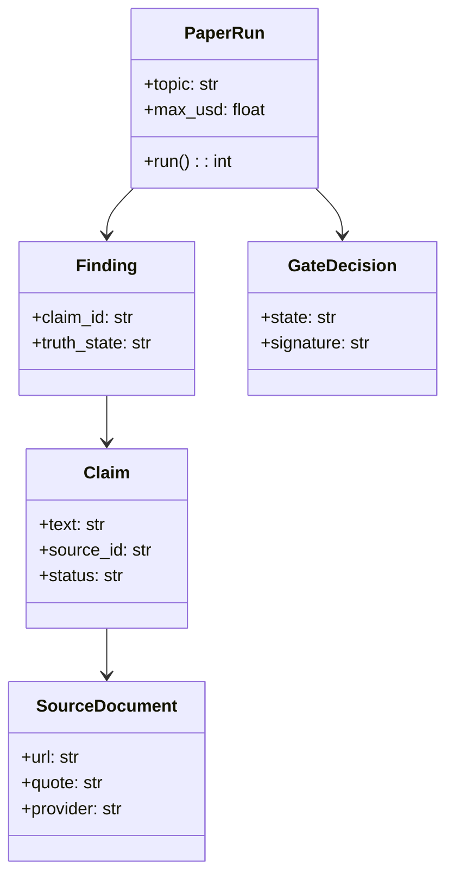
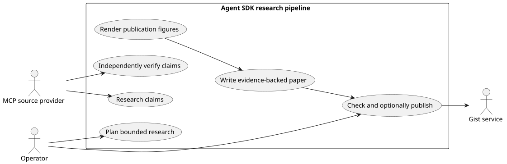

# Lab 3 Agent SDK Research Pipeline

## Software Design Document

## Contents

1. Introduction and goals
2. Constraints and strategy
3. Building blocks
4. Runtime and evidence model
5. House style and the evidence contract
6. Deployment, quality, and risks
7. Glossary

## 1. Introduction and goals

This standalone Claude Agent SDK solution turns a topic into an evidence-backed technical white paper, local figures, a PDF receipt, and an optional secret Gist publication. It retains its research artifacts as a knowledge bundle even when the paper fails a gate.

### Functional requirements

- Plan a bounded set of research questions and diagrams.
- Retrieve claims from configured MCP sources and verify each claim independently.
- Render source diagrams through the local rendering path and record fidelity issues.
- Write paper sections from surviving claims, assemble references, and apply hard paper checks.
- Stop on success, stable failure, turn limits, or an USD budget; publish only after a pass and explicit request.

### Quality requirements

- The researcher, verifier, locator, and judge cannot write the paper.
- Only the writer has a folder-limited `Write` permission; Python writes structured phase artifacts.
- No role has `Bash`; rendering runs with fixed Python arguments.
- MCP providers are declared in code and fail closed when unavailable.
- Tests run without SDK, keys, network, or image backend.

## 2. Constraints and strategy

The agent roles interpret sources and draft content, but Python retains authority over cost, stage completion, citation checks, paper gating, and publication. Context7 is always configured; Perplexity is enabled only with a configured API key. Source policy and citation validation prevent a source returned by a model from becoming trusted automatically.



The pipeline has a single controlled writing boundary for prose and records all other structured outputs from Python. Source: [`docs/diagrams/architecture.mmd`](docs/diagrams/architecture.mmd).

## 3. Building blocks

```text
sol3_research_agent_sdk/
├── loop.py                   CLI and top-level runner
├── research.py               Provider boundary and cost cap
├── paper.py                  Phase orchestration and assembly
├── gates.py                  Pass, retry, and escalation rules
├── evidence.py               Claims, sources, and findings
├── locate.py                 Cabinet cross-reference and URL admission
├── source_policy.py          Approved-host and citation filtering
├── diagrams.py               Source-to-figure rendering and audit
├── paper_check.py            Deterministic paper assertions
├── pdf_report.py             Arctic Fox PDF export and receipt
├── publish.py                Optional secret Gist publication
└── tests/                    Offline unit and integration checks
```

| Module | Responsibility |
| --- | --- |
| `loop.py` | Parses topic, budget, backend, and publication intent. |
| `research.py` | Retrieves filtered source evidence while checking spend during work. |
| `evidence.py` | Represents claims and independent verification outcomes. |
| `locate.py` | Picks the cabinet findings and admits the URL the locator returns. |
| `paper.py` | Reuses completed phase artifacts and assembles the final Markdown. |
| `diagrams.py` | Tracks source figure generation and bounded fidelity redraws. |
| `paper_check.py` | Enforces sources, grounding, citations, images, and style. |

## 4. Runtime and evidence model



Locate runs inside each section, after research and before the gap pass. The
locator receives one source title, one vendor, and the head of one claim, and it
returns the public page that carries that document. It holds no corpus tool, so
it cannot confirm the cabinet with itself. Python admits the answer and writes
`url:` onto the matching SourceDocument in the brain. It caches the result in
`knowledge/located.json`, so a second claim from the same source costs no turn.
A source it cannot place is dropped from the section and recorded in
`knowledge/<id>/unresolved.json`. The gap pass then researches that question
again on the live web.

Retries are at the unit level, not a whole expensive research pass. A pass that later exceeds a budget is not discarded if all deterministic checks have completed. Source: [`docs/diagrams/workflow.mmd`](docs/diagrams/workflow.mmd).



The verifier receives claim text but not the researcher's answer, preserving an independent second look. Source: [`docs/diagrams/sequence.mmd`](docs/diagrams/sequence.mmd).



Claims point to retrievable source evidence. Findings store the verdict rather than replacing evidence, which supports later audit and reuse. Source: [`docs/diagrams/model.mmd`](docs/diagrams/model.mmd).



PlantUML source: [`docs/diagrams/use-cases.puml`](docs/diagrams/use-cases.puml).

## 5. House style and the evidence contract

The paper follows one house style, published once on the wiki as [Sol-3-White-Paper-Style](https://github.com/RichardHightower/reliable-agentic-lab/wiki/Sol-3-White-Paper-Style). The check module grades third person and no marketing verb (`person`, `marketing`), no contraction and no Latin abbreviation (`ste_language`), and a heading that answers its own question (`question_heading`). The body names no search host (`policy_leak`) and states a caveat once (`caveat_once`). A first-use term earns a `TERM:` marker and a Glossary entry (`glossary_complete`, `glossary_exact`). A figure earns a caption and a mention in its own section (`captioned`, `figure_referenced`). The body carries Methods and, for a human study, a study table (`methods_present`, `study_table`), with front matter above the Abstract (`front_matter`). The last body section is a next step, never a sale (`next_step`, `cta_language`), and the abstract is written last, graded against the body (`abstract_matches_body`).

The evidence contract is arithmetic, not a promise from the model. `source_policy.py` seeds the allowlist by field (`seed_for_field`), bans a host outright (`DENYLIST`), and grades a source's tier (`tier_for`). A shaky numeric claim spends one follow turn, and a generalizing claim spends one counter turn before a lever is ruled out; the `counterweighed` row names a claim nobody checked. A safety claim needs a cited guideline (`guideline_cited`), and a question with stated evidence requirements needs `evidence_requirements_met`. A citation's title, authors, and year come from the fetched record, never the model's guess, and a claim earns attribution only when the fetched text supports it. A diagram is graded against the section's own claims before it is embedded.

## 6. Deployment, quality, and risks

`task table`, `task checks`, and `task test` are offline checks. `task setup` installs the Agent SDK, PDF dependencies, and pinned local image plugins. Fixture mode supports a bounded local demo; live research requires appropriate source-provider credentials. A secret Gist is unlisted, not access-controlled.

| Quality scenario | Expected behavior |
| --- | --- |
| A source provider is denied or unavailable | No fabricated claim is produced; the run records the missing evidence. |
| Claims disagree | The finding is disputed and the paper names the disagreement or omits it. |
| Cost limit is reached mid-verification | Remaining claims are unverified, not silently promoted. |
| Paper gate fails | Publication is blocked; evidence remains in the work bundle. |

Risks include source-provider cost and availability, prompt or renderer fidelity, and citation drift. The solution mitigates them through host policy, independent verification, fixed gates, phase checkpoints, and opt-in publication.

## 7. Glossary

| Term | Meaning |
| --- | --- |
| Atomic claim | A small factual statement with source and verification evidence. |
| Cabinet claim | A claim the second brain already holds. It needs a public URL before it can be cited. |
| Locator | The role that cross-references one cabinet source title to the public page a reader can open. |
| Finding | Verification result for a claim. |
| Knowledge bundle | Retained source, claim, evidence, and finding artifacts. |
| Secret Gist | Unlisted GitHub Gist; possession of the URL gives access. |
| Hard gate | Deterministic condition required before publication. |
