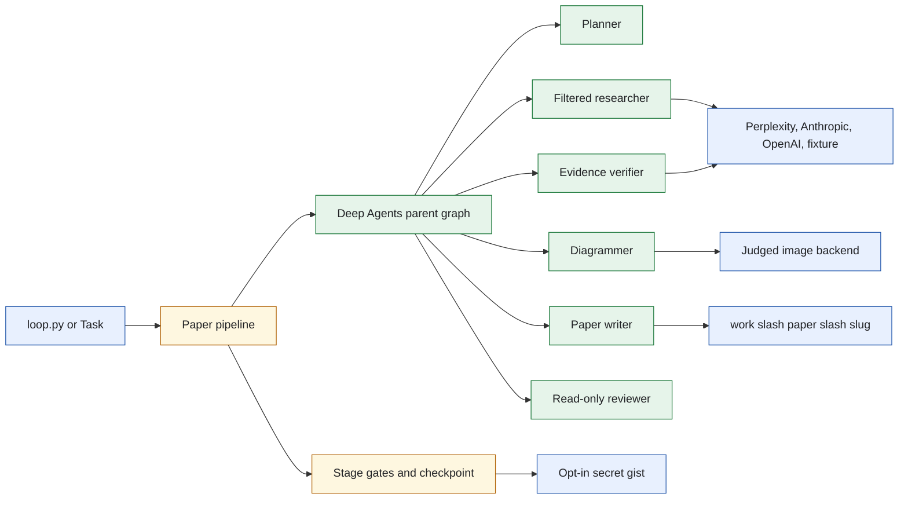
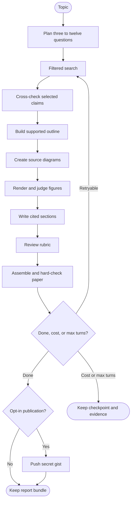
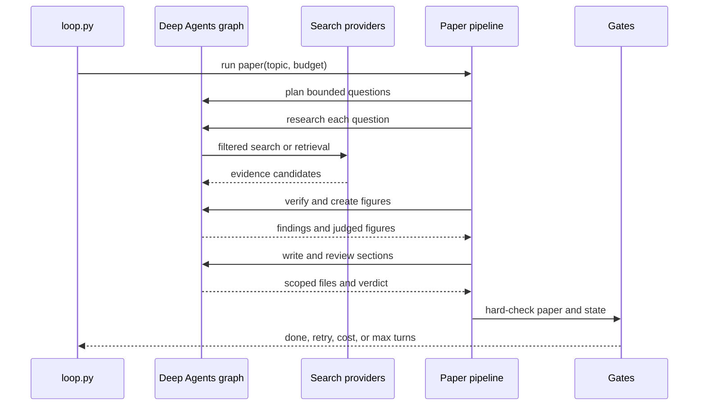
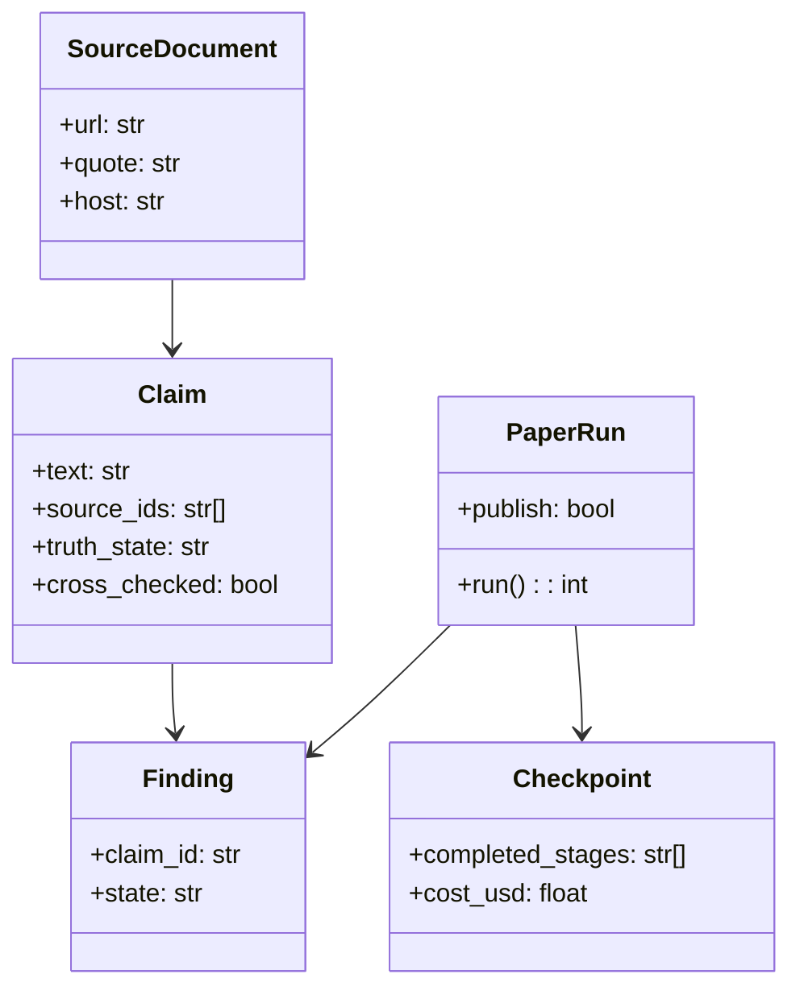
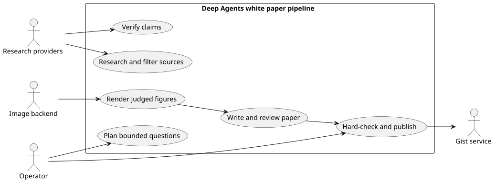

# Lab 3 Deep Agents Research Pipeline

## Software Design Document

## Contents

1. Introduction and goals
2. Constraints and strategy
3. Building blocks
4. Runtime and evidence model
5. House style and the evidence contract
6. Deployment, quality, and risks
7. Glossary

## 1. Introduction and goals

This Deep Agents solution produces a cited research brief or an evidence-backed white paper. The paper mode runs nine stages: planning, search, verification, outline, diagram, writing, review, assembly, and optional publication. It treats grounding, cost, and stopping as program-owned policy rather than agent judgment.

### Functional requirements

- Plan three to twelve research questions and limited figures.
- Search approved sources, record claims, and cross-check prioritized claims.
- Build Mermaid or PlantUML source diagrams and accept only judged publication figures.
- Write scoped paper sections, review them, assemble the final artifact, and gate publication.
- Preserve a resumable checkpoint and stop in the documented order: done, cost, then max turns.

### Quality requirements

- Writer, verifier, and diagrammer have distinct write paths; reviewer, researcher, and locator have none.
- Tool lists, custom path checks, virtual filesystem mounts, and disabled general-purpose subagents form four fences.
- No Bing fallback is used for normal auto research.
- `task test`, `task table`, and `task checks` are offline.

## 2. Constraints and strategy

Deep Agents provides delegated subgraphs, not policy. `roleplan.py` owns the seven-role scope map; `paper.py` owns nine-stage orchestration; `stages.py`, `gates.py`, and `paper_check.py` supply deterministic transition rules. The research boundary filters URLs through an official-host policy before a claim can reach the paper.



Each role's context and tool set are intentionally narrow, preserving independence between research, verification, and prose generation. Source: [`docs/diagrams/architecture.mmd`](docs/diagrams/architecture.mmd).

## 3. Building blocks

```text
sol3_research_deep_agents/
├── loop.py                   Brief and paper entry points
├── paper.py                  Nine-stage pipeline and resumable run
├── stages.py                 Stage-level validation
├── gates.py                  Done, retry, cost, and turn decisions
├── roles.py                  Deep Agents construction and fences
├── roleplan.py               Fourteen-role scopes
├── research.py               Filtered provider boundary and cost control
├── evidence.py               Source, claim, and corroboration model
├── locate.py                 Cabinet cross-reference and URL admission
├── diagrams.py               Mermaid and PlantUML publication figures
├── paper_check.py            Final hard checks
├── publish.py                Opt-in secret Gist publication
└── tests/                    Offline pipeline and isolation tests
```

| Module | Responsibility |
| --- | --- |
| `paper.py` | Coordinates phase outputs, retry boundaries, and checkpoint recovery. |
| `roles.py` | Builds role-specific graphs and removes filesystem escape paths. |
| `research.py` | Selects a filtered provider chain and enforces spending limits. |
| `evidence.py` | Models sources, claims, findings, and corroboration. |
| `locate.py` | Builds the locator's question and admits the URL it returns. |
| `diagrams.py` | Enforces source inventory and image-fidelity acceptance. |
| `paper_check.py` | Validates references, citations, body, images, style, and exit wording. |

## 4. Runtime and evidence model



Locate runs inside the search stage, on each reply, before the ledger records
it. The locator receives one source title, one vendor, and one quote, and it
returns the public page that carries that document. Its single `locate` tool
sends no domain filter and reads no corpus, so the cross-reference cannot
confirm the cabinet with itself. Python admits the URL, stamps `located_from`
on the source, writes `url:` onto the SourceDocument in the brain, and caches
the answer in `corpus/located.json`. A source it cannot place is dropped with
every claim that named it and recorded in `corpus/unresolved.json`. The
`reference_hosts` gate exempts a located source, because the librarian never
admitted a domain for a document the cabinet already held.

The cost test happens before every model call and has headroom based on observed role cost. Source: [`docs/diagrams/workflow.mmd`](docs/diagrams/workflow.mmd).



The parent pipeline is the only component that converts stage information into a terminal state. Source: [`docs/diagrams/sequence.mmd`](docs/diagrams/sequence.mmd).



`truth_state` counts source agreement, while `cross_checked` records whether a verifier made a separate retrieval. This distinction is important when budget limits truncate verification. Source: [`docs/diagrams/model.mmd`](docs/diagrams/model.mmd).



PlantUML source: [`docs/diagrams/use-cases.puml`](docs/diagrams/use-cases.puml).

## 5. House style and the evidence contract

The paper follows one house style, published once on the wiki as [Sol-3-White-Paper-Style](https://github.com/RichardHightower/reliable-agentic-lab/wiki/Sol-3-White-Paper-Style). The check module grades third person and no marketing verb (`person`, `marketing`), no contraction and no Latin abbreviation (`ste_language`), and a heading that answers its own question (`question_heading`). The body names no search host (`policy_leak`) and states a caveat once (`caveat_once`). A first-use term earns a `TERM:` marker and a Glossary entry (`glossary_complete`, `glossary_exact`). A figure earns a caption and a mention in its own section (`captioned`, `figure_referenced`). The body carries Methods and, for a human study, a study table (`methods_present`, `study_table`), with front matter above the Abstract (`front_matter`). The last body section is a next step, never a sale (`next_step`, `cta_language`), and the abstract is written last, graded against the body (`abstract_matches_body`).

The evidence contract is arithmetic, not a promise from the model. `source_policy.py` seeds the allowlist by field (`seed_for_field`), bans a host outright (`DENYLIST`), and grades a source's tier (`tier_for`). A shaky numeric claim spends one follow turn, and a generalizing claim spends one counter turn before a lever is ruled out; the `counterweighed` row names a claim nobody checked. A safety claim needs a cited guideline (`guideline_cited`), and a question with stated evidence requirements needs `evidence_requirements_met`. A citation's title, authors, and year come from the fetched record, never the model's guess, and a claim earns attribution only when the fetched text supports it. A diagram is graded against the section's own claims before it is embedded.

## 6. Deployment, quality, and risks

`task paper` runs fixture research, while `task live` enables the filtered provider chain after local setup. Figure creation depends on the pinned local rendering plugins and an image backend. Publication is explicit and never invoked by a failed paper path.

| Quality scenario | Expected behavior |
| --- | --- |
| Research returns an unapproved host | The Python filter drops it before paper generation. |
| Diagram source loses labels in the image | The pipeline requests a bounded redraw or records the fidelity miss. |
| Cost cap is reached | The next model call is refused and the checkpoint is preserved. |
| Reviewer fails a rubric row | The hard-check path cannot publish the paper. |

Risks include provider availability, image-backend availability, non-public Gist links, and research cost. The solution addresses them with fail-closed renderer behavior, staged checkpoints, source filtering, and cost checks inside phases.

## 7. Glossary

| Term | Meaning |
| --- | --- |
| Cabinet claim | A claim the second brain already holds. It needs a public URL before it can be cited. |
| Cross-checked | A verifier independently retrieved evidence for a claim. |
| Locator | The role that cross-references one cabinet source title to the public page a reader can open. |
| Fixture backend | Recorded offline research source used for deterministic runs. |
| Checkpoint | State that allows completed pipeline stages to be skipped on resume. |
| Figure fidelity | Whether the rendered image retains the meaning and labels of its source. |
| Stage gate | Deterministic condition that permits moving to the next paper stage. |
