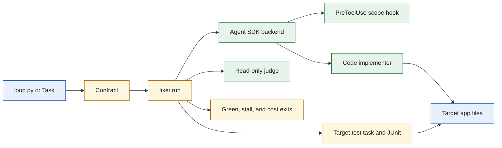
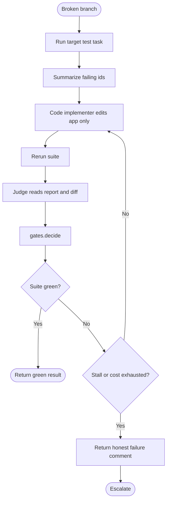
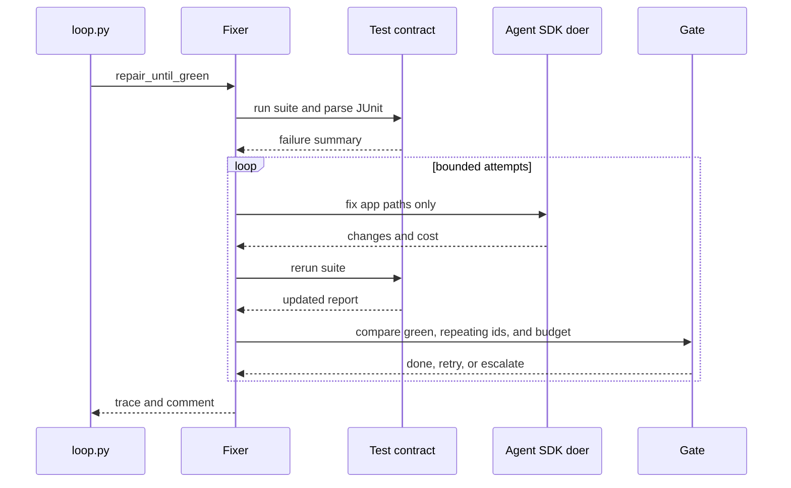
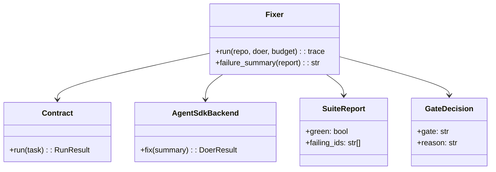
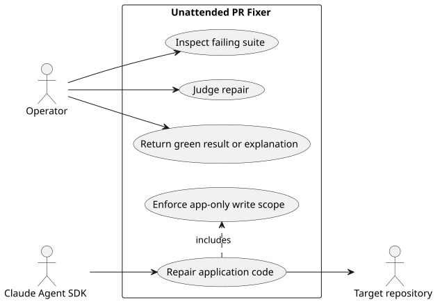

# Lab 4 Agent SDK PR Fixer

## Software Design Document

## Contents

1. Introduction and goals
2. Constraints and strategy
3. Building blocks
4. Runtime and model
5. Deployment, quality, and risks
6. Glossary

## 1. Introduction and goals

This standalone Claude Agent SDK loop repairs a known broken branch or returns an honest explanation. It runs tests in Python, gives the code implementer access only to application paths, keeps the judge read-only, and stops on a green suite, repeated failing identifiers, or cost exhaustion. Merge is not a tool.

### Functional requirements

- Run the target test task and summarize failures from JUnit.
- Ask the scoped code implementer to repair application files.
- Re-run tests and have the judge assess the resulting evidence.
- Produce a trace and explanatory comment on failure.
- Enforce iteration and USD bounds.

### Quality requirements

- Code implementer is denied `tests/**`.
- Orchestrator and judge cannot write; no role receives `Bash`.
- `dontAsk` is used so unapproved writes fail closed.
- Tests run without an SDK, API key, network, or CRM clone.

## 2. Constraints and strategy

`loop.py` assembles a target `Contract`, backend, and `fixer.run` operation. The Agent SDK capability boundary has two layers: allowed tools prevent write capability where it is not needed, and one `PreToolUse` hook evaluates the writer's path. The adapter reads `ResultMessage.total_cost_usd` so the monetary exit can actually fire.



The target branch is the only mutable production-like state. This folder does not merge, create a generic driver, or reuse a shared loop. Source: [`docs/diagrams/architecture.mmd`](docs/diagrams/architecture.mmd).

## 3. Building blocks

```text
sol4_fixer_agent_sdk/
├── loop.py                   CLI entry point and backend assembly
├── fixer.py                  Repair lifecycle and failure summary
├── adapter.py                Agent SDK result and cost adaptation
├── roles.py                  SDK options and write hook
├── roleplan.py               Three-role scope declaration
├── gates.py                  Green, stall, and cost decisions
├── contract.py               Target test contract and report parsing
├── write_scope.py            Path policy
└── tests/                    Offline policy and runtime checks
```

| Module | Responsibility |
| --- | --- |
| `fixer.py` | Iterates repair attempts and builds a result trace. |
| `contract.py` | Runs the target test task and exposes suite evidence. |
| `adapter.py` | Preserves role response and measured spend. |
| `roles.py` | Uses SDK `dontAsk` mode and enforces path policy. |
| `gates.py` | Decides green completion, retry, or visible escalation. |

## 4. Runtime and model



The loop is intentionally test-first: a repair proposal without a subsequent suite result is not success. Source: [`docs/diagrams/workflow.mmd`](docs/diagrams/workflow.mmd).



The payment signal takes the same path as test evidence: it enters program logic and affects a deterministic gate. Source: [`docs/diagrams/sequence.mmd`](docs/diagrams/sequence.mmd).



`SuiteReport` and `GateDecision` are the important durable decision inputs. There is no database or ERD. Source: [`docs/diagrams/model.mmd`](docs/diagrams/model.mmd).



PlantUML source: [`docs/diagrams/use-cases.puml`](docs/diagrams/use-cases.puml).

## 5. Deployment, quality, and risks

Run `task table` and `task test` before optional setup. A live path needs the Agent SDK, credentials, CRM clone, and a clean `broken-pr` branch. `task reset` prepares the branch; it is not an automatic merge or deployment action.

| Quality scenario | Expected behavior |
| --- | --- |
| Tests are green | The loop exits successfully without a new repair turn. |
| Failing IDs repeat | The gate stops and returns an explanation. |
| SDK reports cost beyond the cap | The cost branch ends the loop. |
| Writer targets tests | The tool and hook layers deny the write. |

The main risks are target test reliability, SDK permission semantics, and error-free cost adaptation. Tests pin all three assumptions.

## 6. Glossary

| Term | Meaning |
| --- | --- |
| Failing IDs | Stable identifiers extracted from the target JUnit suite. |
| Green | Test suite state with no reported failure. |
| `dontAsk` | Agent SDK mode that denies actions not already allowed. |
| Trace | Structured record of repair attempts, gate result, and comment. |
