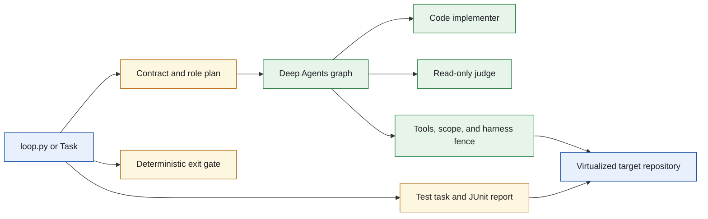
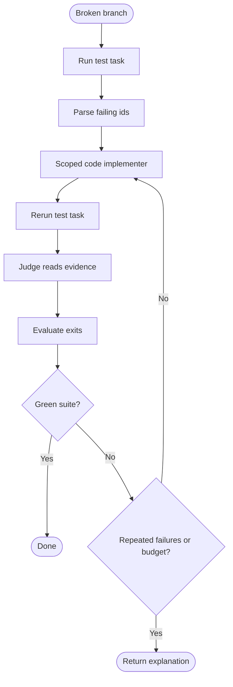
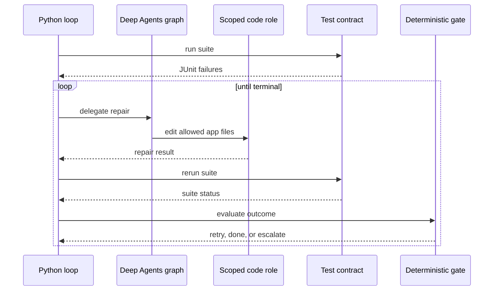
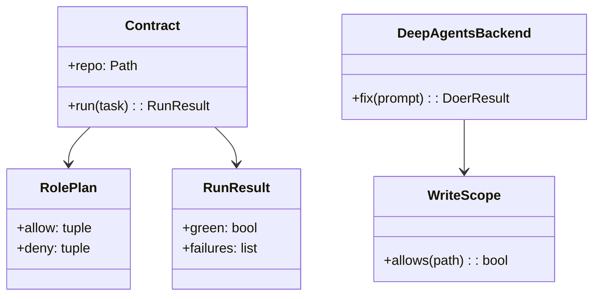
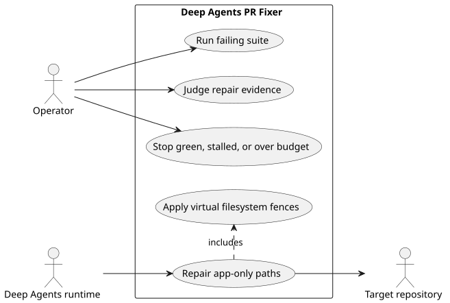

# Lab 4 Deep Agents PR Fixer

## Software Design Document

## Contents

1. Introduction and goals
2. Constraints and strategy
3. Building blocks
4. Runtime and model
5. Deployment, quality, and risks
6. Glossary

## 1. Introduction and goals

This standalone LangChain Deep Agents port repairs a broken CRM branch within a bounded unattended loop. It checks the suite, lets a scoped code implementer change application files, rechecks the suite, and returns green, stall, or budget exhaustion evidence. It never merges a branch.

### Functional requirements

- Build the three-role fixer cast: orchestrator, code implementer, and judge.
- Run target tests and collect failure evidence.
- Allow the doer to repair application code but deny test edits.
- Re-evaluate until a deterministic terminal condition is reached.
- Print the cast table and execute tests without an SDK installation.

### Quality requirements

- Deep Agents applies separate role tools, in-tool path checks, a virtual filesystem backend, and harness permissions.
- The default general-purpose subagent is disabled.
- The orchestrator cannot write and the judge receives no write tool.
- Tests verify the runtime receives every fence setting.

## 2. Constraints and strategy

`loop.py` contains only the runtime translation: target contract, role plan, Deep Agents backend. The deterministic repair behavior belongs in the folder's concrete loop artifacts, not a generic library. `roles.build_agent` enforces the four-layer fence; `write_scope.py` evaluates deny paths before allows.



The virtualized repository prevents built-in filesystem tools from walking outside the target. Custom tools still validate their own paths. Source: [`docs/diagrams/architecture.mmd`](docs/diagrams/architecture.mmd).

## 3. Building blocks

```text
sol4_fixer_deep_agents/
├── loop.py                   CLI and Deep Agents assembly
├── roles.py                  Graph configuration and four-layer fence
├── roleplan.py               Three-role scope declaration
├── write_scope.py            Deny-first path evaluator
├── contract.py               Target test task contract
├── adapter.py                Deep Agents response adapter
├── gates.py                  Terminal condition policy
├── memory/                   Mounted role memory
└── tests/                    Offline policy and graph wiring tests
```

| Module | Responsibility |
| --- | --- |
| `roles.py` | Gives each role its tools, mounts, permissions, and backend. |
| `roleplan.py` | Declares allowed and denied paths per role. |
| `write_scope.py` | Refuses a prohibited path before it reaches disk. |
| `contract.py` | Runs target tests and exposes results. |
| `adapter.py` | Maps graph output to the repair backend contract. |

## 4. Runtime and model



The deterministic gate treats a repeated failure as a terminal signal rather than a request for more autonomous activity. Source: [`docs/diagrams/workflow.mmd`](docs/diagrams/workflow.mmd).



The model does not execute the test task or decide that the result is green. Source: [`docs/diagrams/sequence.mmd`](docs/diagrams/sequence.mmd).



Target files and JUnit output are the data model. The loop needs no relational store. Source: [`docs/diagrams/model.mmd`](docs/diagrams/model.mmd).



PlantUML source: [`docs/diagrams/use-cases.puml`](docs/diagrams/use-cases.puml).

## 5. Deployment, quality, and risks

`task test` and `task table` work without an SDK. `task setup` prepares a folder-local Deep Agents environment; `task clone` and `task reset` prepare the target branch. Live execution requires the target clone and model credentials.

| Quality scenario | Expected behavior |
| --- | --- |
| Built-in or general-purpose agent tries to write | The harness profile hides write tools and disables the general-purpose agent. |
| Code role selects a test path | The deny-first scope rule returns a refusal. |
| A test failure persists across attempts | The exit gate stops and reports it. |
| The virtual mount sees a parent path | The backend containment policy rejects the traversal. |

Risks are Deep Agents runtime changes, target repository contract drift, and model repair quality. The folder's tests inspect both the custom scope checks and the arguments sent to `create_deep_agent`.

## 6. Glossary

| Term | Meaning |
| --- | --- |
| Virtual mode | Filesystem backend mode that prevents parent-path traversal. |
| General-purpose subagent | Default Deep Agents agent disabled to prevent a broad tool escape path. |
| Deny-first rule | Scope evaluation order that rejects forbidden paths before an allow match. |
| Repair evidence | Suite report and diff information used to make a gate decision. |
